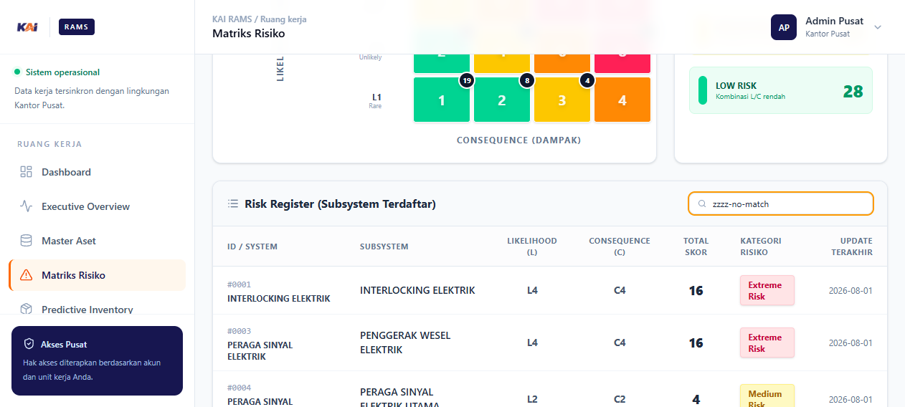
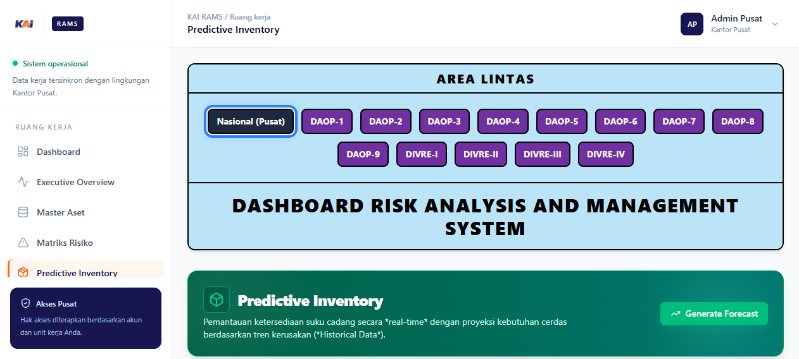
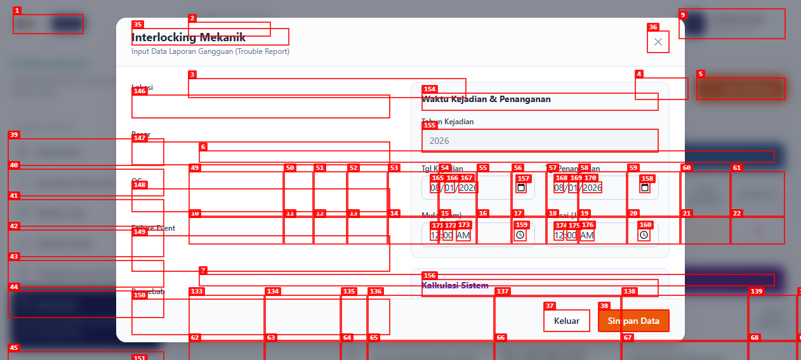

# Dogfood Report: KAI RAMS

| Field | Value |
|-------|-------|
| **Date** | 2026-08-01 |
| **App URL** | http://127.0.0.1:8000 |
| **Session** | kai-rams-local |
| **Scope** | Login, dashboard, filter wilayah, matriks risiko, inventory, dan form trouble report tanpa menyimpan data uji |

## Summary

| Severity | Count |
|----------|-------|
| Critical | 0 |
| High | 2 |
| Medium | 2 |
| Low | 0 |
| **Total** | **4** |

## Issues

### ISSUE-001: Executive Overview menampilkan halaman putih

| Field | Value |
|-------|-------|
| **Severity** | high |
| **Category** | functional / console |
| **URL** | http://127.0.0.1:8000/overview |
| **Status** | Resolved 2026-08-01 |
| **Repro Video** | N/A |

**Description**

Halaman Executive Overview tidak merender konten apa pun. Console browser menampilkan `TypeError: Cannot read properties of undefined (reading 'isPusat')`, sehingga visualisasi ringkasan tidak dapat digunakan.

Perbaikan mengganti referensi auth dummy yang tertinggal dengan prop backend `selected_area`. Hasil verifikasi: [Overview setelah perbaikan](screenshots/overview-fixed.png).

**Repro Steps**

1. Login sebagai Admin Pusat dan buka menu **Executive Overview**.
2. Amati bahwa URL berubah ke `/overview`, tetapi halaman menjadi putih.
   

---

### ISSUE-002: Pencarian Risk Register tidak memfilter tabel

| Field | Value |
|-------|-------|
| **Severity** | medium |
| **Category** | functional |
| **URL** | http://127.0.0.1:8000/risk-matrix |
| **Repro Video** | N/A |

**Description**

Textbox pencarian menerima input, tetapi isi tabel tidak berubah. Pengujian dengan `Interlocking Mekanik` dan kata tanpa kecocokan `zzzz-no-match` tetap menghasilkan 85 baris.

**Repro Steps**

1. Buka menu **Matriks Risiko**.
2. Isi **Cari subsystem...** dengan `zzzz-no-match`.
3. Tunggu pembaruan UI; seluruh 85 baris tetap tampil.
   

---

### ISSUE-003: Predictive Inventory tidak menampilkan stok yang sudah diimpor

| Field | Value |
|-------|-------|
| **Severity** | high |
| **Category** | functional |
| **URL** | http://127.0.0.1:8000/predictive-inventory |
| **Repro Video** | N/A |

**Description**

Master Aset menampilkan data aset dan sparepart, tetapi Predictive Inventory selalu menampilkan `Belum ada stok inventaris` pada Nasional maupun DAOP-1. Akibatnya tabel proyeksi 30 hari belum dapat digunakan dari data hasil impor.

**Repro Steps**

1. Buka menu **Predictive Inventory**.
2. Periksa wilayah Nasional lalu DAOP-1.
3. Amati tabel hanya berisi empty state.
   

---

### ISSUE-004: Form Trouble Report tidak memiliki nama aksesibel

| Field | Value |
|-------|-------|
| **Severity** | medium |
| **Category** | accessibility |
| **URL** | http://127.0.0.1:8000/trouble-report?subsystem=Interlocking%20Mekanik |
| **Repro Video** | N/A |

**Description**

Audit axe-core menemukan 5 kelompok pelanggaran: 11 elemen form tanpa label, 2 select tanpa accessible name, satu tombol tanpa nama, masalah kontras pada 6 node, dan satu area scroll yang tidak dapat difokuskan lewat keyboard. Pengguna pembaca layar kesulitan mengetahui fungsi field.

**Repro Steps**

1. Dari Dashboard buka subsystem **Interlocking Mekanik**.
2. Klik **Input Manual**.
3. Jalankan audit WCAG 2 A/AA; field tampil sebagai textbox/combobox tanpa nama.
   

---
